# Laporan P10
## Jobsheet 8

Jawaban

Pertanyaan 8.2.3
1.	Pada method create, atribut rear dan front diisialisasi -1 sebagai tanda bahwa queue tersebut masih kosong. Mengapa tidak 0, karena jika 0 artinya queue tersebut sudah memiliki nilai yaitu 0, tetapi jika -1 berarti masih kosong karena -1 tidak masuk ke dalam jangkauan angka 0 – tak terhingga.
2.	Maksud dari potongan kode program tersebut pada method enqueue adalah jika rear sama dengan max dikurangi 1 maka rear sama dengan 0
3.	Kode program yang menunjukkan bahwa data baru disimpan pada posisi terakhir di dalam queue pada method enqueue
* 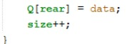
4.	Kode program yang menunujukkan bahwa data yang dikeluarkan adalah data di posisi paling depan pada method dequeue 
* 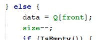
5.	Maksud dari potongan kode program tersebut pada method dequeue adalah jika front sama dengan max dikurangi 1 maka front sama dengan 0, dan kode program tersebut digunakan untuk data paling depan yang disimpan pada method dequeue jika ternyata tidak memenuhi kondisi apakah data masih kosong
6.	Pada method print, yaitu pada proses perulangan variabel i mengapa tidak dimulai dari 0 (int i = 0) melainkan int i = front, karena posisi front tidak selalu berada pada index ke-0
7.	Maksud dari potongan kode program tersebut pada method print yaitu ketika i bukan merupakan rear maka akan mencetak data[i] dengan nilai i yaitu i ditambah 1 lalu di modulu max

Pertanyaan 8.3.3
1.	Fungsi potongan kode program tersebut pada method dequeue merupakan instansiasi objek dari class penumpang
2.	Jika pada soal no 1, kode proram diganti dengan Penumpang data = new Penumpang() maka yang terjadi adalah eror karena pada class penumpang terdapat konstruktor yang memiliki parameter String nama, String kotaAsal, String kotaTujuan, int jml, int harga
3.	Kode program yang digunakan untuk menampilkan data yang dikeluarkan dari queue adalah 
* 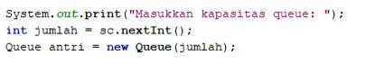

Tugas 8.4

1. Kode Program
* 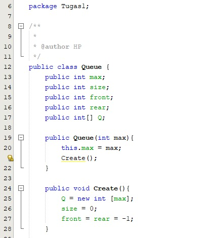
* 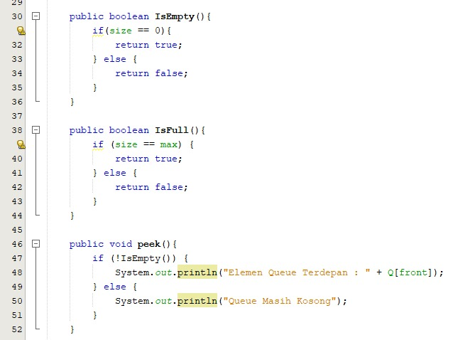
* 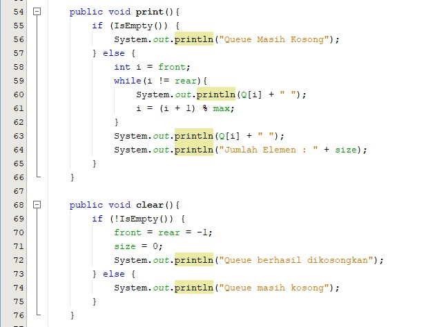
* 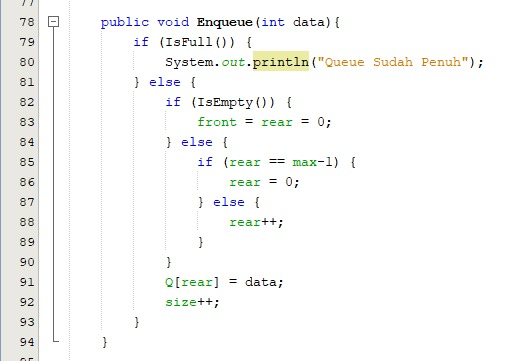
* 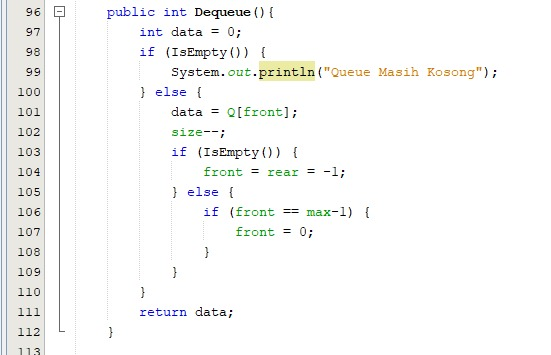
* 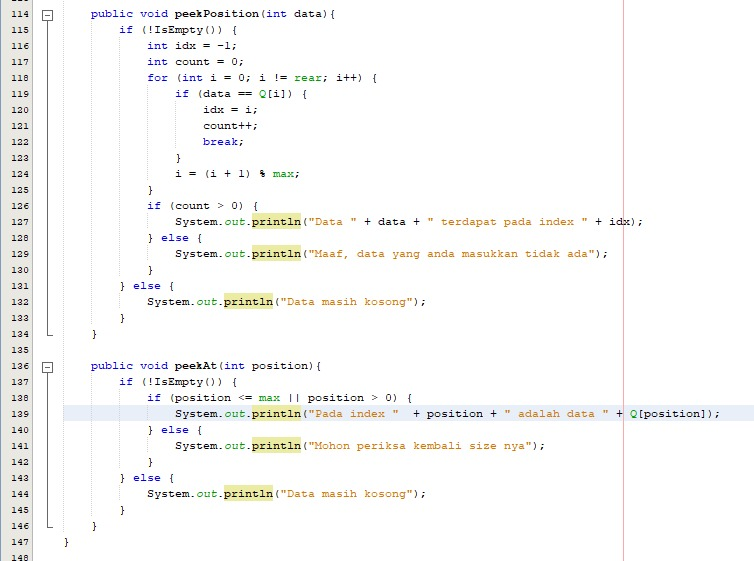
* 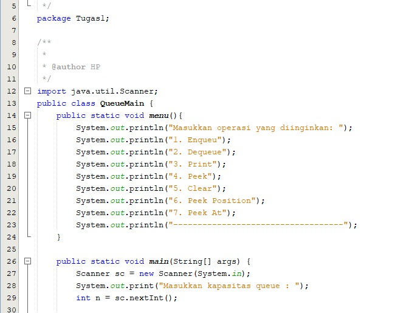
* 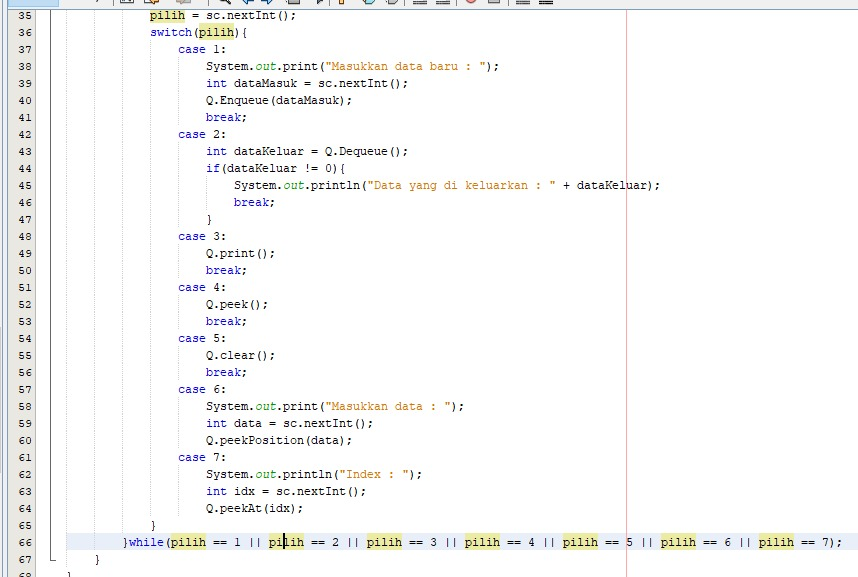

Output
* 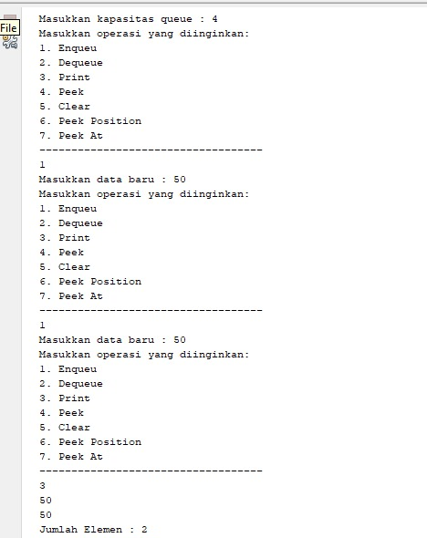
* 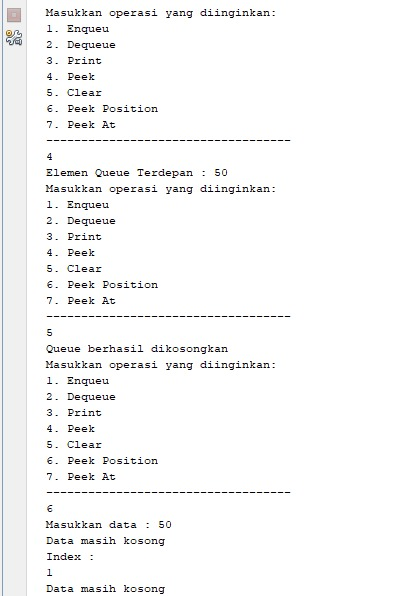
* 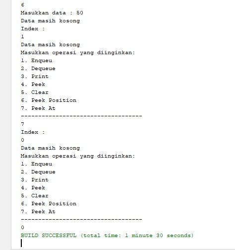

2. Kode Program
* 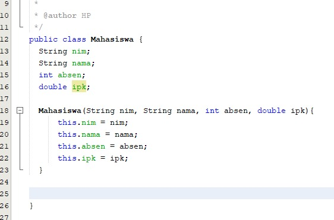
* 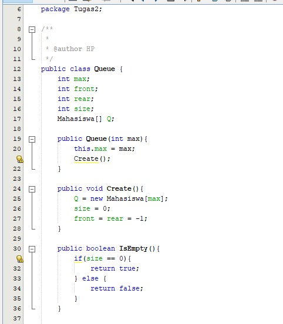
* 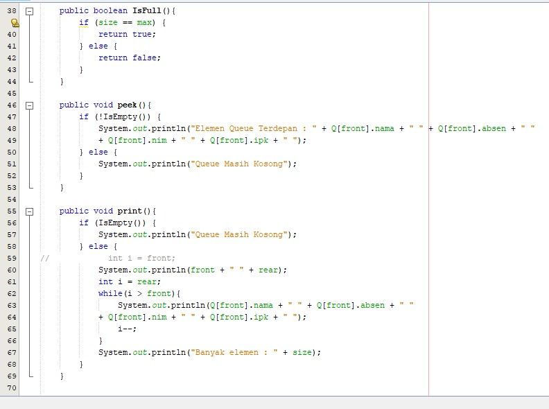
* 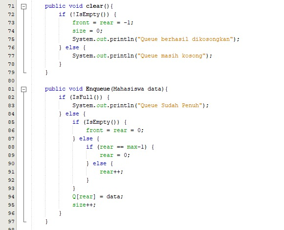
* 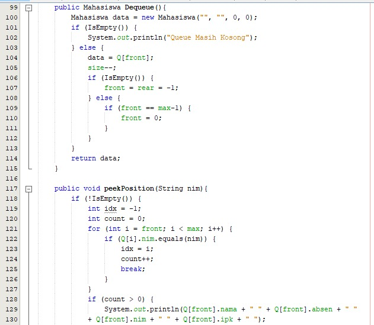
* 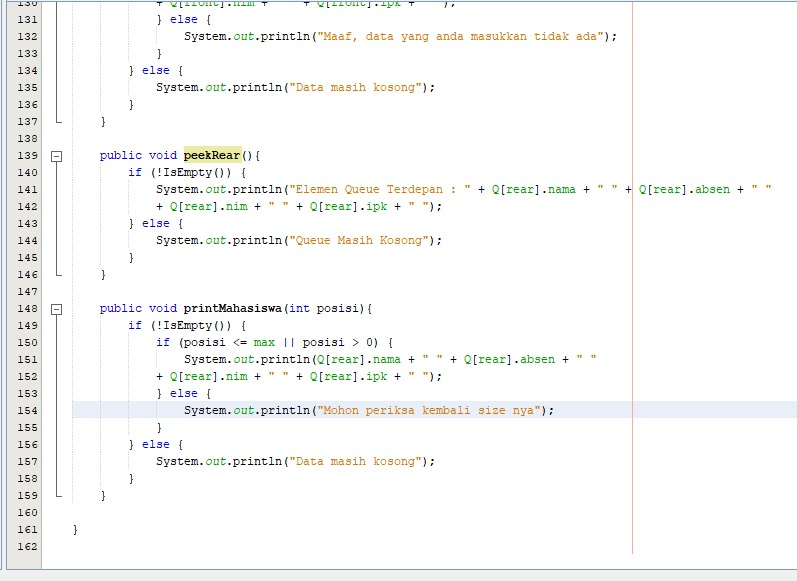
* 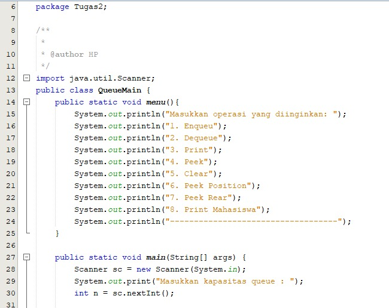
* 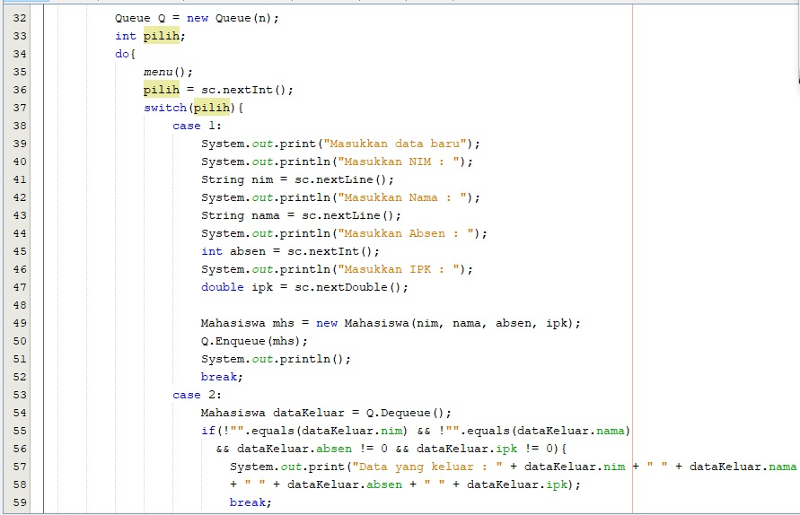
* 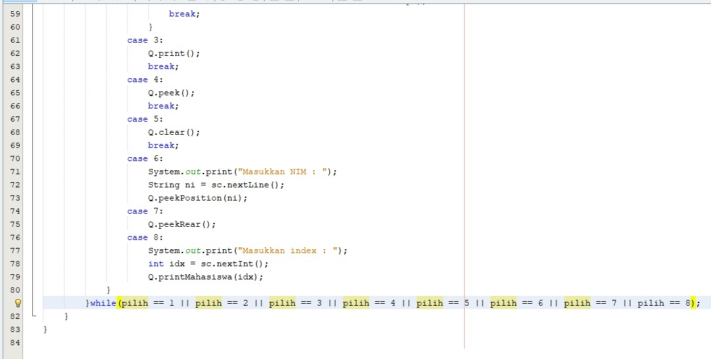

Output
* 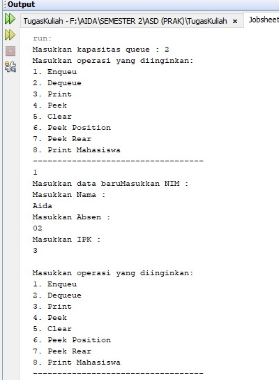
* 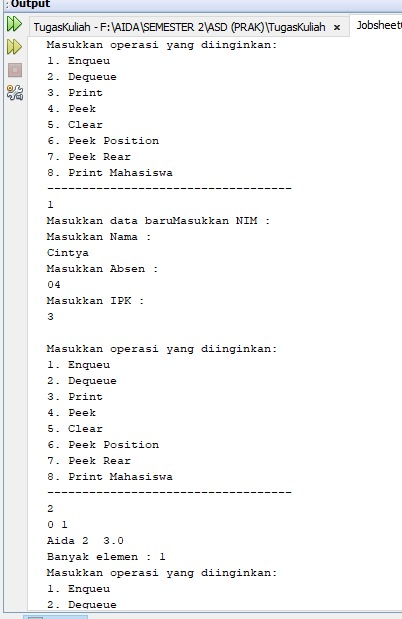
* 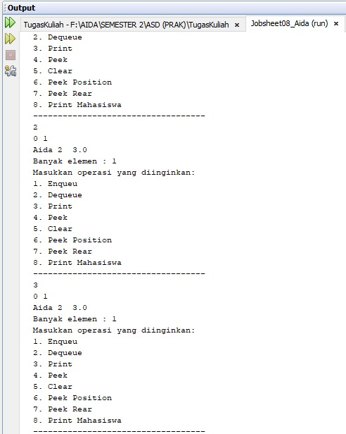
* 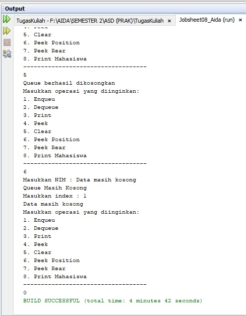