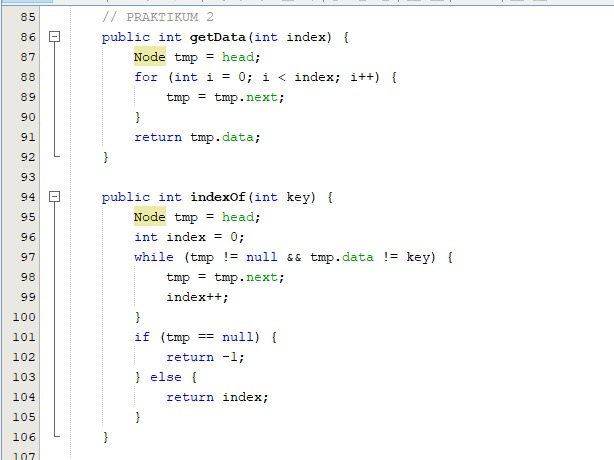
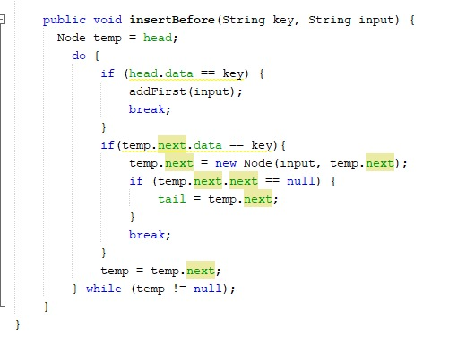

# Laporan P11
## Jobsheet 9

Jawaban

Pertanyaan 9.2.3
1.	Pada hasil compile baris pertama menghasilkan linked list kosong karena method yang di jalankan dulu adalah method print, sedangkan pada linked list belum diisikan data sama sekali maka dari itu hasil yang keluar adalah “linked list kosong”
2.	Maksud kode program tersebut pada step 10 adalah digunakan untuk mendeklarasikan nilai dari next pada node yang baru diinputkan sama dengan nilai nilai next sebelum nya dimana next dari data sebelumnya adalah node yang diinputkan
3.	Maksud dari kode program tersebut adalah kondisi jika nilai next next dari temp dan tail sama dengan next dari temp

Pertanyaan 9.3.3
1.	Fungsi keyword ‘break’ pada fungsi remove berfungsi supaya kondisi pada fungsi remove tidak terus menerus berjalan
2.	Fungsi kode tersebut pada fungsi remove adalah kondisi lain pada method remove jika kondisi if tidak terpenuhi, dimana maksud dari kode tersebut adalah next data awal data sama dengan key maka next pada data awal sama dengan next next data awal
3.	Nilai kembalian pada pada method indexOf antara lain yaitu :
    a. Kode Program
    * 

    Return -1  maksudnya adalah jika tmp bernilai null maka akan mengembalikan nilai -1 yang artinya tidak ada

    b. Kode Program
    * 

    Return index  maksudnya adalah jika kondisi if pertama tidak terpenuhi atau tmp tidak sama dengan 0 maka akan mengembalikan nilai yaitu index

9.4 Tugas

1. Kode Program
   * 
   * 
   * 
   * 
   * 
   * 
   * 
   * 
   * 
   * 

   Output
   * 

2. Kode Program
   * 
   * 
   * 
   * 
   * 
   * 

   Output
   * 

3. Kode Program
   * 
   * 
   * 
   * 
   * 
   * 

   Output
   * 

4. Kode Program   
   * 
   * 
   * 
   * 
   * 
   * 
   * 
   * 
   * 

   Output
   * 

5. Kode Program
   * 
   * 
   * 
   * 
   * 
   * 
   * 
   * 
   * 

   Output
   * 

