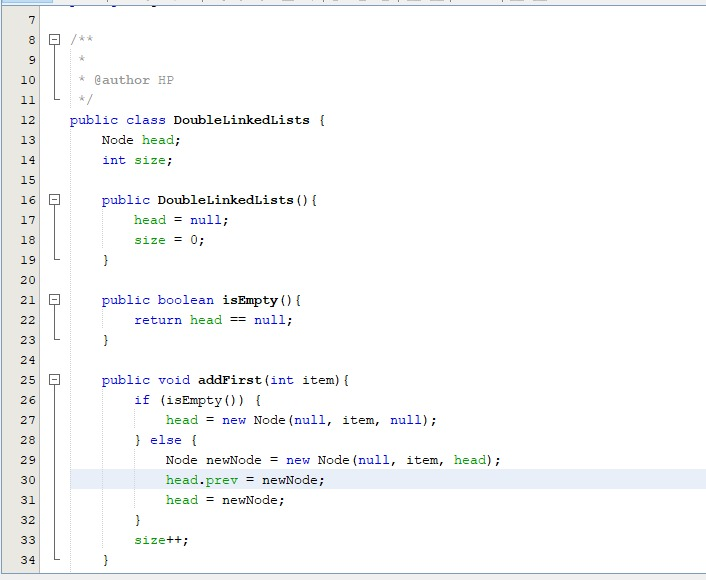
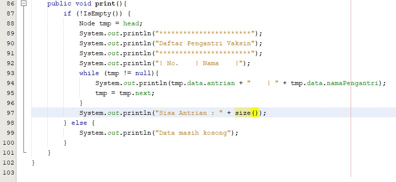

# Laporan P12
## Jobsheet 12

Pertanyaan 12.2.3
1.	Perbedaan antara single linked list dan double linked list adalah terletak pada pointer nya, dimana pointer pada single linked list hanya next (pointer sesudahnya) dan untuk double linked listed memiliki dua pointer yaitu next (pointer sesudahnya) dan prev (pointer sebelumnya)
2.	Fungsi dari atribut next dan prev pada class node adalah digunakan untuk : 

    a.	Next : menunjuk pada node sesudahnya

    b.	Prev : menunjuk pada node sebelumnya

3.	Kegunaan dari inisialisasi atribut head dan size seperti kode program tersebut adalah untuk menandakan bahwa head atau node yang terletak diawal masih kosong dan size double linked list masih 0 atau yang berarti bahwa double linked listed masih belum terisi oleh data
4.	Pada method addFirst() di pembuatan object dari konstruktor class Node, prev dianggap sama dengan null atau kosong karena digunakan untuk tempat data yang akan ditambahkan pada sebelum node (item)
5.	Maksud dari statement head.prev = newNode pada method addFirst() adalah node sebelum head merupakan node baru
6.	Arti dari pembuatan object Node dimana parameter prev sama dengan current dan next sama dengan null adalah karena akan menambahkan data pada akhir linked list maka parameter next dibuat sama dengan null atau kosong untuk tempat data yang akan ditambahkan pada akhir linked list. Sedangkan untuk prev sama dengan current adalah bahwa node sebelumnya yang menjadi fokus saat ini

Pertanyaan 12.3.3
1.	Maksud dari statement tersebut pada method removeFirst() adalah dimana jika linked list ternyata tidak kosong datanya lebih dari satu maka node yang ditunjuk oleh pointer next dari head dan node yang ditunjuk oleh pointer prev dari head (yang sebenarnya null/kosong) akan dikurangi atau dihapus
2.	Cara mendeteksi posisi data yang ada pada bagian akhir dari method removeLast() adalah sama dengan node yang ditunjuk oleh pointer next dari head == null / kosong, dimana head di inisialisasi sama dengan null dan size-- kemudian di return
3. Node yang sedang dijalankan tidak membutuhkan node tambahan (tmp) langsung menuju pada head
4. Kode program tersebut berfungsi untuk melewati satu node

Pertanyaan 12.4.3
1.	Maksud dari method size() pada class DoubleLinkedLists adalah bertujuan untuk mengembalikan nilai (return) jumlah data yang ada di dalam linked lists yang sudah diperbarui untuk ditampilkan kembali nilai size linked lists
2. Untuk merubah indeks supaya bisa dimulai dari ke-1, maka mengganti head dengan head.next atau dengan kata lain melewati 1 node
3. Karena pada single linked list hanya memiliki satu pointer, maka ketika menambahkan data hanya fokus pada pointer next. Jika double linked list maka yang diperhatikan adalah kedua pointernya yaitu next dan previous
4.	Perbedaan logika dari kedua kode program tersebut adalah : 

    a.	Menentuka terlebih dahulu apakah size dari linked list sama dengan 0, jika memenuhi kondisi tersebut akan mengembalikan true atau yang berarti kondisi tersebut benar, dan jika tidak memenuhi kondisi tersebut yang akan dikembalikan adalah false atau kondisi tersebut tidak terpenuhi

    b.	Method tersebut akan menjalankan statement mengembalikan nilai head == null, atau head sama dengan kosong  

12.5 Tugas Praktikum

1. Kode Program
   * 
   * 
   * 
   * 
   * 
   * 
   * 
   * 
   * 
   * 
   * 
   * 
   * 
   * 

   Output
   * 
   * 
   * 
   * 

2. Kode Program
   * 
   * 
   * 
   * 
   * 
   * 
   * 
   * 
   * 

   Output
   * 
   * 
   * 
   * 
   * 

3. Kode Program
   * 
   * 
   * 
   * 
   * 
   * 
   * 
   * 
   * 

   Output
   * 
   * 
   * 
   * 
   * 