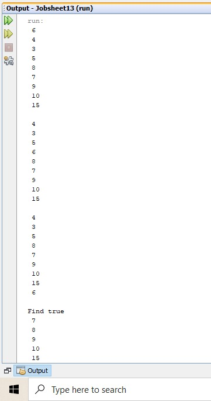

# Laporan P14
## Jobsheet 13

Jawaban Pertanyaan
13.2.2 Pertanyaan Percobaan
1.	Dalam binary search tree proses pencarian data lebih efektif dilakukan dibanding dengan binary tree biasa karena binary search tree memiliki sifat bahwa semua left-child harus lebih kecil daripada right-child dan parentnya, atau disebut dengan ordered binary tree yaitu binary tree yang seluruh children dari tiap node terurut. Binary search tree sendiri juga memiliki tujuan untuk mengatasi kelemahan pada binary tree biasa yaitu kesulitan dalam melakukan pencarian node tertentu dalam binary tree
2.	Kegunaan atribut left dan right pada class node adalah untuk posisi child dari setiap node, apakah child tersebut disebelah kiri (left) atau right (kanan)
3.	 
    a.	Atribut root pada class binary tree memiliki fungsi untuk node yang terletak pada posisi paling atas atau node yang tidak memiliki predesesor

    b.	Ketika objek tree pertama kali dibuat, nilai dari root adalah null atau masih kosong
4.	Ketika tree masih kosong dan akan ditambahkan node baru maka proses yang akan terjadi adalah add atau penambahan data (jika tree masih kosong maka akan mengisi data pada root)
5.	Pada method add terdapat baris kode program tersebut yang berfungsi untuk menambahkan data jika nilai dari data kurang dari current.data maka data akan diletakkan pada node sebelah kiri jika node sebelah kiri bernilai null, apabila tidak maka akan current.left akan diisikan node baru 

13.3.2 Pertanyaan Percobaan
1.	Atribut data dan idxLast pada class binary tree array memiliki fungsi yaitu :

    a.	Atribut data : digunakan untuk data (array) yang akan digunakan

    b.	idxLast : digunakan untuk index terakhir pada array
2.	method populateDate() memiliki fungsi yaitu mengisikan data array dan juga index terakhir dari array
3.	method traverse in order memiliki fungsi untuk menulusuri atau menampilkan array secara rekursif seluruh data pada subtree sebelah kiri lalu mencetak root dan mencetak seluruh data pada subtree sebelah kanan secara rekursif
4.	 a. Posisi Left Child --> 5

     b. Posisi Right Child --> 6 

5.	Kegunaan dari setatement idxLast = 6 pada praktikum 2 nomor 4 adalah untuk menentukan panjang array

13.4 Tugas Praktikum
1. Kode Program
   * 
   * 
   * 
   * 
   * 
   * 
   * 
   * 
   * 
   * 
   * 
   * 

   Output
   * 
   * 

2. Kode Program
   * 
   * 

   Output
   * 
   * 

3. Kode Program
   * 
   * 

   Output
   * 
   * 

4. Kode Program
   * 
   * 

   Output
   * 
   * 

5. Kode Program
   * 
   * 
   * 

   Output
   * 

   

   

