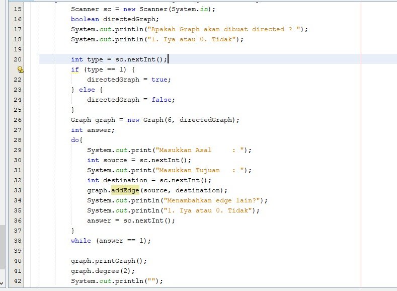

# Laporan Pertemuan 15
## Graph

Jawaban

12.2.3 Pertanyaan Percobaan
1.	Algoritma yang menggunakan dasar graph adalah :
a.	Algoritma Brent (Brent R P 1980)
Algoritma ini digunakan untuk menentukan adanya daur dalam graf
b.	Algoritma Hopcroft-Karp (Hopcroft J E 1973)
Algoritma ini digunakan untuk penjodohan maksimum
c.	Algoritma Hungaria
Algoritma ini digunakan untuk penjodohan sempurna
2.	Variable linked list pada class graph digunakan untuk vertex pada graph
3.	Karena method addFirst() digunakan untuk menambahkan source
4.	Cara mendeteksi prev pointer pada saat akan melakukan penghapusan suatu edge pada graph adalah ketika pada kondisi apakah i == destination (tujuan) atau tidak, jika iya maka akan menjalankan statement menghapus destination (tujuan)

12.3.3 Pertanyaan Percobaan
1.	Perbedaan degree (derajat) pada directed dan undirected graph adalah 

    --> directed : antara vertex A dan B atau AB memiliki edge 1, vertex B dan A atau BA memiliki edge edge 8 
    
    --> undirected : antara vertex A dan B atau AB ataupun sebaliknya sama saja memiliki edge 1

2. Digunakan untuk deklarasi array 2 dimensi, maka kedua vertex nya ditambah 1

3. Untuk menampilkan lintasan antara vertex

4. Berarah namun tidak berbobot

12.4 Tugas Praktikum

1. Kode Program
   * 
   
   Output
   * 

2. Kode Program
   * 
   * 
   * 
   * 

   Output
   * 

3. Kode Program
   * 

   Output
   * 

4. Kode Program
   * 
   * 
   * 
   * 
   * 
   * 
   * 
   * 
   * 
   * 
   * 
   * 
   * 
   * 

   Output
   * 

   

   

