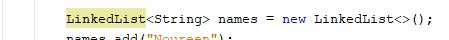
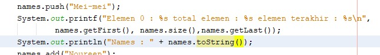
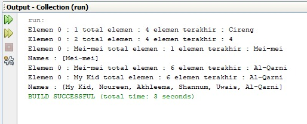

# Laporan Pertemuan 16
## Jobsheet Collection

16.2.3. Pertanyaan Percobaan
1.	ArrayList digunakan dalam menyimpan data berbentuk objek, sehingga untuk menyimpan data di dalam ArrayList maka harus membuat sebuah kelas yang kemudian dijadikan objek yang dapat menyimpan data. ArrayList terdapat pada kelas java.util, sehingga untuk menggunakan ArrayList, maka harus melakukan import java.util
2.	
3.	Merubah kode pada baris kode 38
    * 
4.	Menambahkan no 3
    * 
5. Output
    * 
    

16.3.3. Pertanyaan Percobaan
1.	Push merupakan method yang berada di interface stack sedangkan add di interface arrayList
2.	Ketika kode program pada line ke 43 dan 44 (print durian dan melon) dihapus, maka yang terjadi adalah ketika kode program dijalankan tidak mengeluarkan output “Melon Durian”, karena pada perulangan terakhir yang ada di kode program, method get tidak menjalankan statement apapun
3.	Fungsi kode program pada line ke 46-49 adalah untuk menampilkan seluruh element pada stack. 
4.	Ketika kode program pada line ke 25 dirubah menjadi List<String> yang terjadi adalah eror, hal itu dikarenakan pada kode program tidak dituliskan “import java.util.List”

16.4.3. Pertanyaan Percobaan
1.	Unlimited argments merupakan java varargs dimana hal tersebut digunakan untuk kebutuhan dengan jumlah ‘tak tentu’ dari benda-benda. Kelebihan varargs adalah dapat digunakan ketika kita tidak yakin tentang jumlah argumen yang harus disampaikan dalam suatu metode. Jika kita memiliki metode yang kelebihan beban untuk menerima jumlah parameter yang berbeda, maka alih-alih menggunakan kelebihan waktu yang berbeda, kita cukup menggunakan konsep varargs

