## Jawaban Pertanyaan
## 2.2.3
1.	Karakteristik dari object/class adalah atribut dan method, atribut yaitu data yang dimiliki oleh object atau class sedangkan method merupakan proses atau tingkah laku yang bisa dilakukan oleh object atau class
2.	 Kata kunci yang digunakan untuk mendeklarasikan class adalah “class”
3.	Atribut pada percobaan class barang ada 4, yaitu: :
    a.	namaBarang pada line 13
    b.	jenisBarang pada line 13
    c.	stok pada line 14
    d.	hargaSatuan pada line 14
4.	Method pada percobaan class barang ada 4, yaitu :
    a.	tampilBarang() pada line 16-21
    b.	tambahStok() pada line 23-25
    c.	kurangiStok() pada line 27-29
    d.	hitungHargaTotal() pada line 31-34
5.  
* 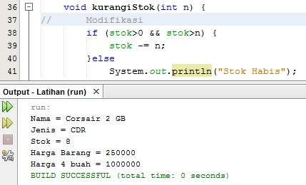

6.	Karena parameter tersebut digunakan untuk mengurangi stok dan menggunakan tipe data int karena jumlah  barang
7.	Karena method tersebut me-return jumlah yang dikalikan hargaSatuan dengan tipe data int
8.	Karena method tersebut tidak mengembalikan nilai atau tidak me-return nilai 
## 2.2.3
1.	Proses intansiasi dilakukan pada line ke 15-19 dan nama objek yang dihasilkan adalah nama = corsair 2 GB, jenis = DDR, Stok, dan harga satuan
2.	Dengan menuliskan fungsi atau memanggil fungsinya, yaitu dengan cara menuliskan objek.atribut seperti b1.hitungHargaTotal()
## 2.4.3
1.	Deklarasi konstruktor dengan parameter dilakukan pada line ke 18-23
2.	Yang dilakukan adalah mengisikan nilai yang biasanya dilakukan sesuai dengan konstruktor parameter, dan maksud dari baris tersebut adalah mengisikan nilai "Logitech", "Wireless Mouse", 150000, dan 25
## latihan
1.  Class Lingkaran
 * 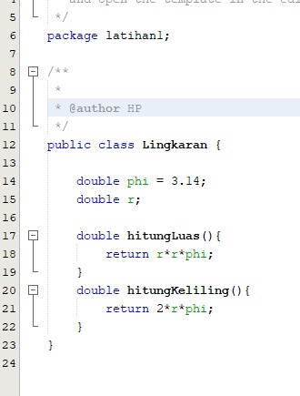
 * 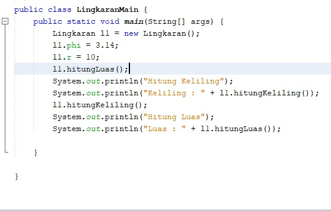
    
    output
    * 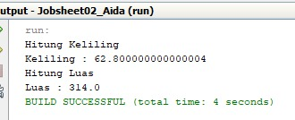

2.  Class Sewa Game
    * 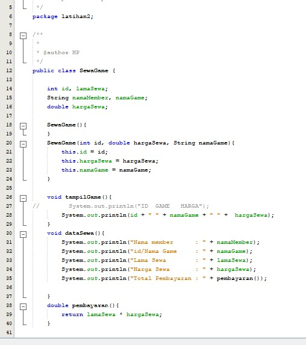
    * 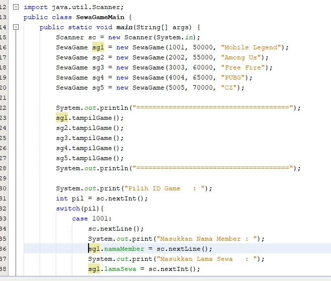
    * 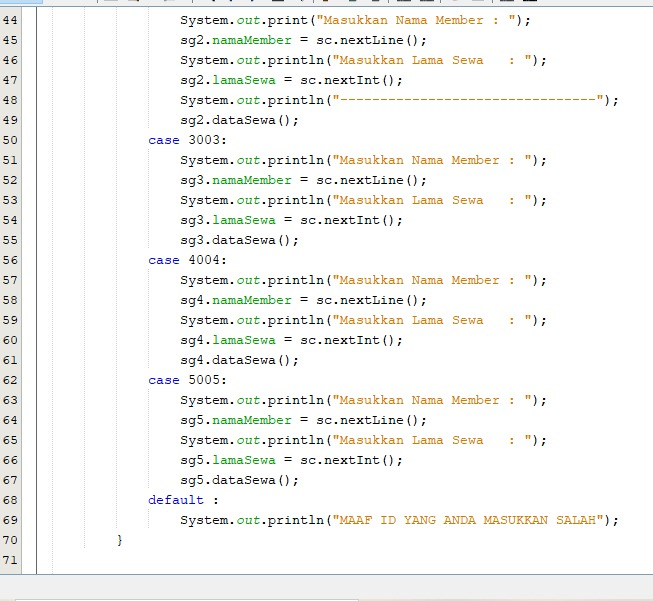

    output
    * 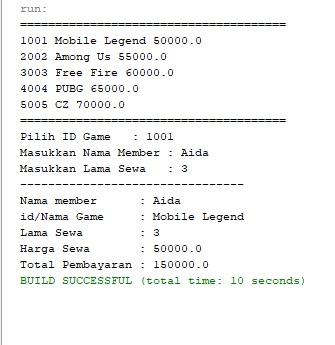

3.  Class Barang
    * 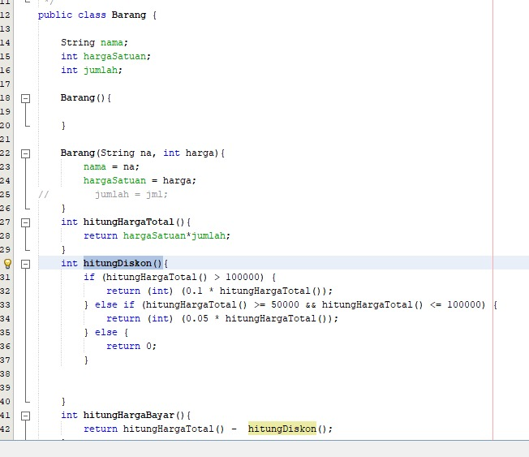
    * 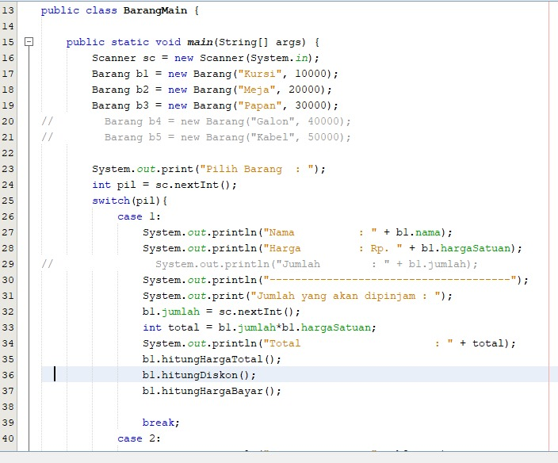

    output
    * 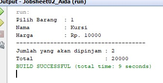

4.  Class PacMan
    * 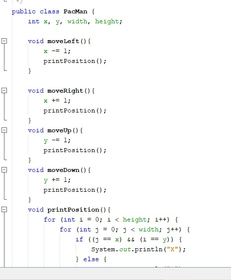
    * 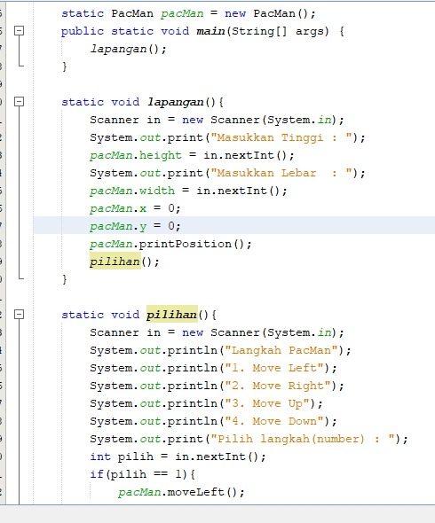
    * 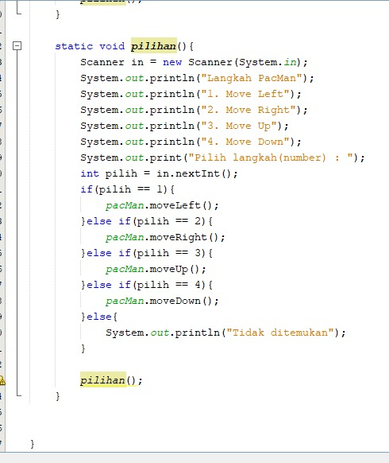

    output
    * 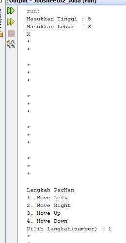