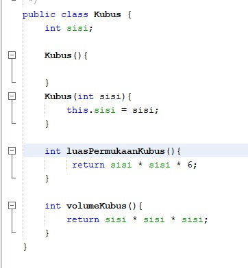
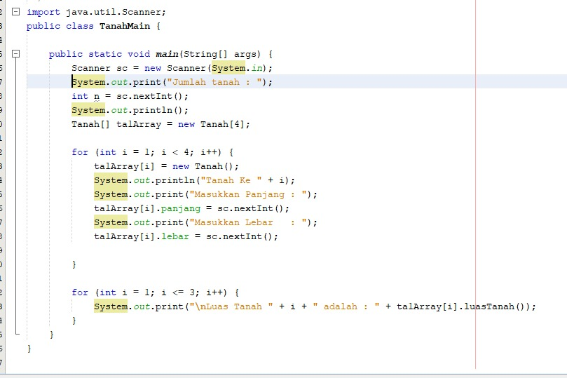

# Laporan
## Jawaban Soal
3.2.3
1.	Berdasarkan uji coba 3.2 class yang akan dibuat oleh array of object harus selalu memiliki atribut dan method, karena nanti ketika fungsinya dipanggil harus sesuai dengan atribut maupun method nya
2.	Class PersegiPanjang tidak memiliki konstruktor, maka dari itu dilakukan instance object
3.	Kode tersebut merupakan kode untuk deklarasi dan instansiasi Array of Object, dimana ppArray tersebut dapat menampung 3 Array
4.	Maksud dari kode tersebut adalah objek untuk mengisikan sebuah persegi panjang pada array tersebut
5.	Class main dan juga class PersegiPanjang dibedakan pada percobaan tersebut supaya lebih terkonsep antara kelas PersegiPanjang dan juga class main nya, dan lebih memudahkan ketika fungsi nya akan dipanggil

3.3.3
1.	Iya, hasilnya nanti akan berbentuk baris dan kolom beserta indeks nya
2.	Contohnya adalah
    * 
    Misalkan kita akan mengakses "G" maka indeks baris dan kolomnya adalah [0][1]

3.	Kode tersebut akan memunculkan eror karena sebelumnya tidak dituliskan objek nya / ppArray[5] = new Persegi terlebih dahulu
4.  
5. 

3.4.3
1.	Boleh, konstruktor lebih dari satu atau disebut dengan overloading asalkan dengan ketentuan memiliki parameter yang berbeda baik dari jumlahnya maupun tipe datanya setiap konstruktornya
2.	Gambar class Segitiga di soal
3.	Segitiga(int a, int t){
alas = a;
tinggi = t;
}
4.	Int hitungLuas(){

    return (alas*tinggi)/2; 
    
    }
    
    Int hitungKeliling(){
    
    return sisi1+sisi2+sisi3; 
    
    }

## Latihan Praktikum
1. Kode Program
    * 
    * 
    * 
    * 
    * 
   Output
    * 

2. Kode Program
    * 
    * 
   Output
    * 

3. Kode Program
    * 
    * 
   Output
    * 

4. Kode Program
    * 
    * 
   Output
    * 

5. Kode Program
    * 
    * 
   Output
    * 