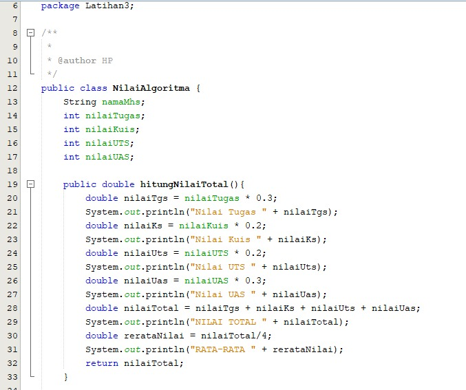

# Laporan Pertemuan 05
## Jobsheet 04 

Jawaban

Pertanyaan 4.2.3

1.	 Base line pada algoritma devide conquer untuk melakukan pencarian faktorial adalah n==1, dimana jika kondisi tersebut bernilai true maka akan me return 1
2.	Pada implementasi algoritma divide and conquer faktorial terdiri 3 tahapan, berikut adalah 3 tahapan yang ditunjukkan pada kode program

    a.	Divide 		:  if (n == 1)

    b.	Conquer 	: int fakto = n * faktorialDC(n-1);

    c.	Combine 	: return fakto;
3. Perulangan pada method faktorialBF() dapat dirubah selain menggunakan for, misalkan saja menggunakan perulangan while
* 

Pertanyaan 4.3.3
1.	Perbedaan mengenai method pangkatBF() dan pangkatDC() adalah : 

    a.	Method pangkatBF() lebih sederhana      dibandingkan dengan method pangkatDC(), karena algoritma brute force merupakan algoritma yang sederhana

    b.	Method pangkatBF() langsung mengeksekusi perulangan yang ada di dalam method pangkatBF() karena algoritma brute force merupakan pendekatan yang lempang, dimana ketika dia memproses maka akan langsung dilanjutkan.
    Method pangkatDC() membagi terlebih dahulu masalah menjadi beberapa sub masalah dan setiap sub masalah akan menyelesaikan masalah nya kemudian di akhir proses akan di combine
2.	Maksud dari kode program pada method pangkatDC() tersebut adalah membagi bilangan ganjil dan genap untuk mengeksekusi statement yang ada, dimana if(n%2==1) atau bilangan ganjil maka akan menjalankan statement return (pangkatDC(a, n/2) * pangkatDC(a, n/2) * a);. Dan apabila bilangan genap maka akan menjalankan statement return (pangkatDC(a, n/2) * pangkatDC(a, n/2));
3.	Tahap combine sudah termasuk dalam kode tersebut, ditunjukkan oleh kode program yaitu : 
Return (pangkatDC(a,n/2) * pangkatDC(a, n/2))
4.
 * 
   *  

Pertanyaan 4.4.3
1.	 Perbedaan antara perhitungan keuntungan menggunakan algoritma brute force dan devide conquer adalah : 
a.	Langkah pengerjaan
Pada langkah pengerjaan, algoritma brute force manjalankan program secara terurut sedangkan algoritma devide conquer menjalankan program dengan membagi sub masalah kemudia mengeksekusi dan meng-combine nya kembali
b.	Kode program
Kode program algoritma brute force lebih sederhana dibandingkan dengan kode program algoritma devide conquer
2.	Dengan menambahkan kode program %.2f
3.	Formulasi return value tersebut merupakan proses combine pada algoritma devide and conquer
4.	Karena nilai pada variabel mid merupakan nilai tengah yang digunakan pada algoritma devide and conquer

Latihan Praktikum

1. Kode Program
   *  
2. Kode Program
   * 
   * 
   Output
   * 
3. Kode Program
   * 
   * 
   * 
   * 
   Output
   * 
   * 
4. Kode Program
   * 
   * 
   * 
   * 
   Output
   * 