# Laporan 
## Jobsheet 5

Jawaban

5.2.3
1.	Method bubble sort terdapat pada method bubbleSort yang bertipe data void dan berada di class DaftarMahasiswaBerprestrasi
2.	 Method selection sort terdapat pada method selectionSort yang bertipe data void dan berada di class DaftarMahasiswaBerprestasi
3.	Proses swap merupakan proses pertukaran, dimana nilai yang di proses pada sorting bubble sort akan di tukar apabila nilai yang dibandingkan lebih kecil dari pada pembanding
Potongan program untuk melakukan swap : 
Mahasiswa tmp = listMhs[j];
listMhs[j] = listMhs[j-1];
listMhs[j-1] = tmp; 
4.	Potongan kode program pada method bubbleSort tersebut digunakan untuk proses perbandingan yang akan dilakukan pada method bubbleSort, jadi listMhs[j].ipk akan dibandingkan dengan listMhs[j-1].ipk. Jika listMhs[j].ipk lebih besar dibandingkan listMhs[j-1].ipk maka akan melakukan proses swap
5. 
   a.) Perbedaan antara perulangan i dan j adalah   perulangan i digunakan untuk perulangan pada nilai yang akan menjadi pembanding atau nilai yang posisi nya berada setelah nilai yang akan dibandingkan. Dan perulangan j dilakukan untuk perulangan nilai yang akan dibandingkan atau nilai yang posisi nya berada sebelum nilai pembanding

   b.) Syarat perulangan i i<listMhs.length-1 adalah karena i merupakan perulangan untuk nilai yang posisi nya setelah nilai yang akan dibandingkan

   c.)  Syarat perulangan j j<listMhs.length-i adalah karena j merupakan perulangan untuk nilai yang posisi nya sebelum nilai yang akan digunakan untuk pembanding

   d.) Jika banyak data di dalam listMhs ada 50, maka perulangan i akan berlangsung sebanyak 50 kali. Dan tahap bubble sort yang akan ditempuh sebanyak 49 kali

5.3.3

    Baris program yang berada di dalam method selection sort tersebut digunakan untuk melakukan proses sorting selection sort, dimana tahapannya yaitu apabila nilai idxMin ditambah 1 kurang dari panjang listMhs maka akan masuk pada kondisi apakah listMhs[j].ipk kurang dari listMhs[idxMin].ipk dan apabila memenuhi pada kondisi tersebut maka idxMin akan dicetak yaitu j

## Latihan Praktikum
1.  Kode Program

    Class Tiket
    * 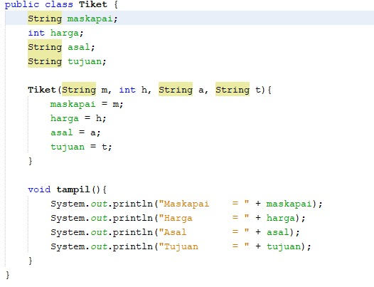
    Class TiketService
    * 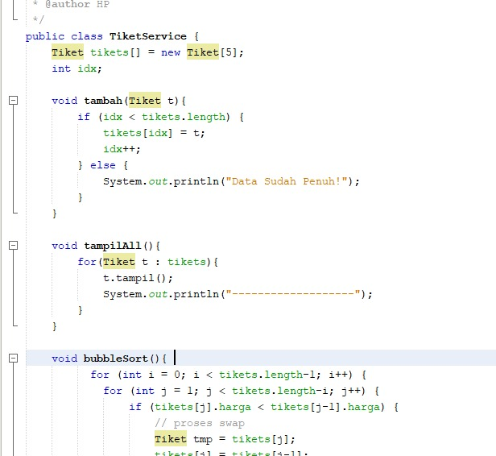
    * 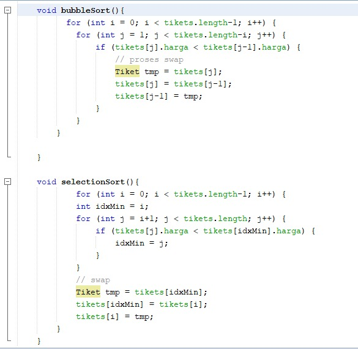
    Class MainTiket
    * 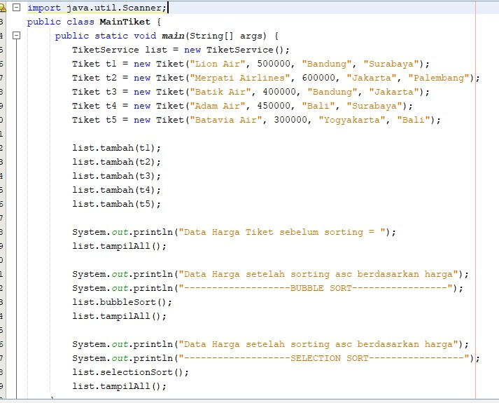
    Output
    * 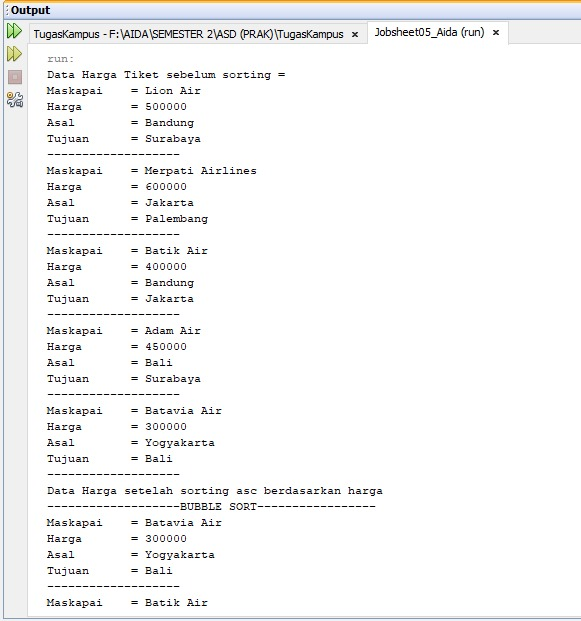
    * 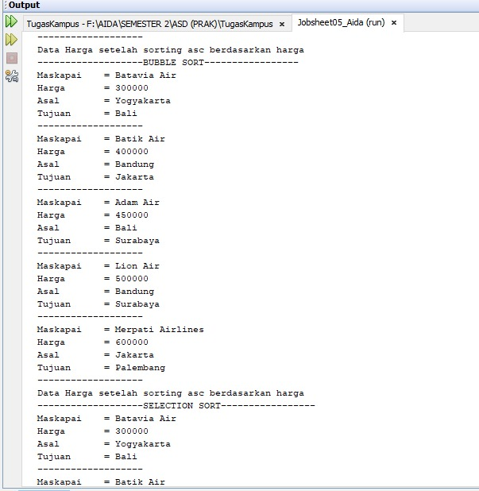
    * 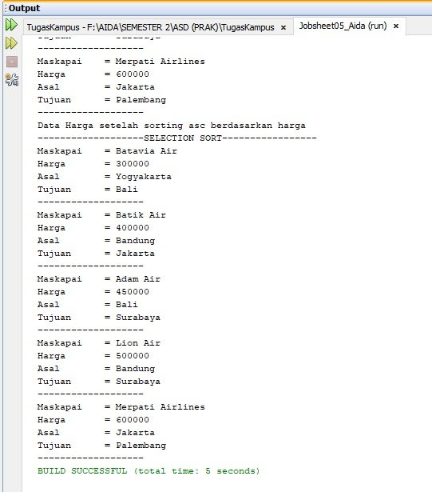

2.  Kode Program

    Class PremierLeague
    * 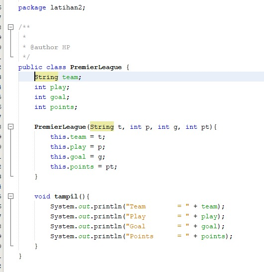
    Class PremierLeagueService
    * 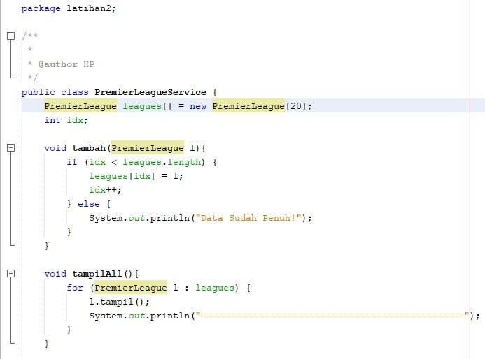
    * 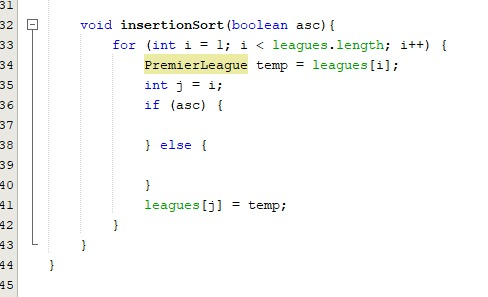
    Class MainLeagues
    * 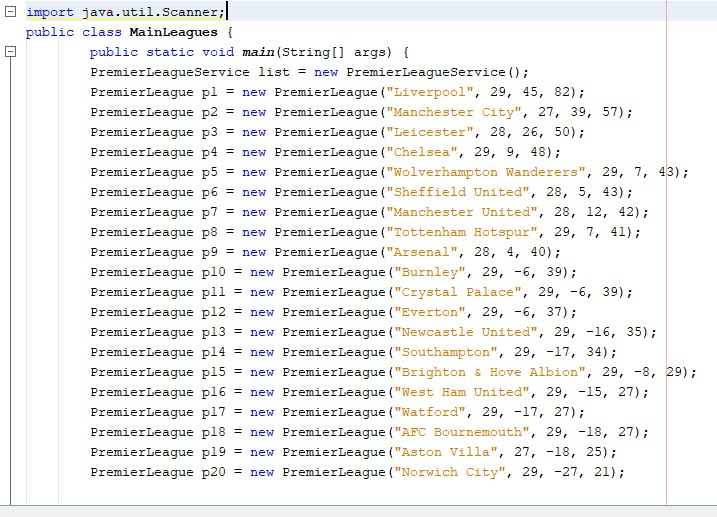
    * 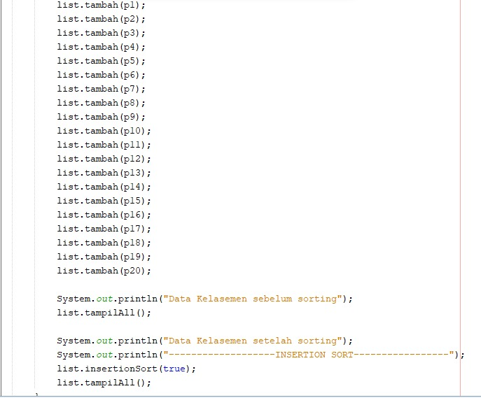
    Output
    * 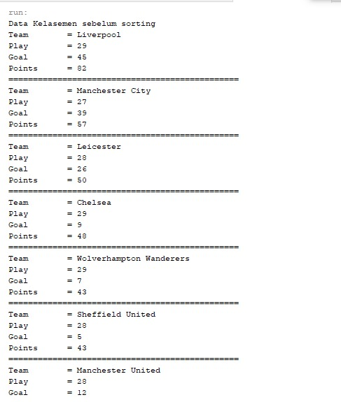
    * 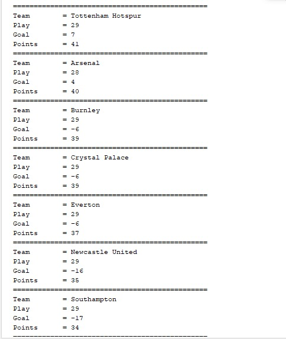
    * 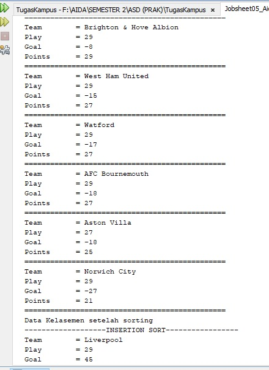
    * 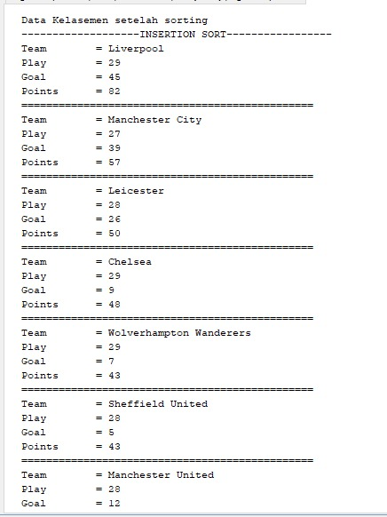
    * 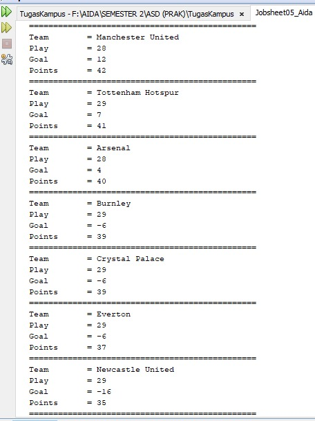
    * 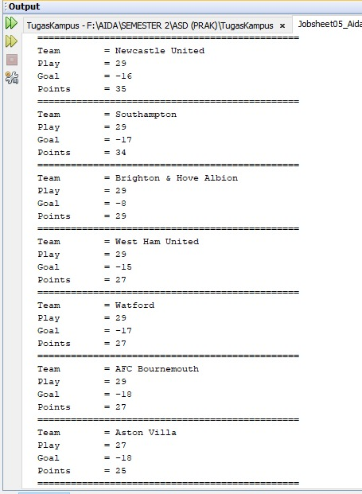
    * 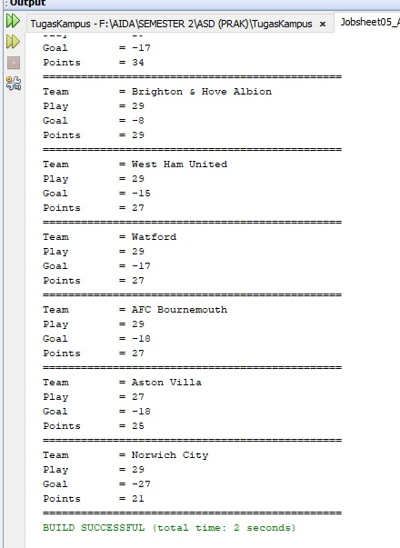