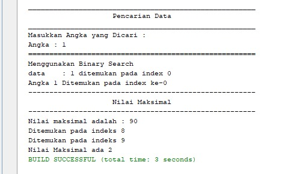

# Laporan 
## Jobsheet 6

Jawaban

6.2.3

1. Perbedaan antara method TampilData dengan        TampilPosisi adalah jika TampilData digunakan untuk menampilkan keterangan dari data seperti berupa nama, umur, ipk dan lain sebagainya. Method TampilPosisi digunakan untuk menampilkan posisi data yang dicari seperti ketika mencari nama maka akan ditemukan pada indeks tertentu dan apabila data tidak ditemukan akan muncul keterangan bahwa data tidak ditemukan
2. Fungsi Break pada kode program tersebut adalah ketika sudah memenuhi kondisi maka akan dihentikan
3. Iya, program masih tetap bisa berjalan. Hasil yang dikeluarkan benar dan sesuai data yang diinputkan dengan kode program jika menggunakan Sequential Search. Karena jika menggunakan Sequential search akan mengeksekusi program secara terurut sesuai dengan kode program

6.3.3

1. Proses divide adalah proses dimana masalah dibagi menjadi sub masalah, pada kode program tersebut ditujukkan oleh kode program : 
if (right >= left) {
        mid = (left + right) / 2;
2. Proses conquer merupakan proses penyelesaian dari sub masalah, pada kode program tersebut ditunjukkan oleh kode program :             if (cari == listMhs[mid].nim) {
                return (mid);
            } else if (listMhs[mid].nim > cari) {
                return FindBinarySearch(cari, left, mid - 1);
            } else {
                return FindBinarySearch(cari, mid + 1, right);
            }
3. hasil tidak sesuai dengan kode program serta tidak sesuai dengan data yang diinputkan ketika menggunakan Binary Search. Karena ketika menggunakan Binary Search akan mengeksekusi program sesuai urutan data, misal ascending maupun descending
4. Hasilnya akan sesuai dan data ditemukan, karena data sudah terurut secara descending dari awal
5.  
* 

## Praktikum

1. Kode Program
   *  
   * 
   * 
   * 
   * 
   * 
   * 

   Output
   * 
   * 
   * 
   * 

2. Kode Program
   * 
   * 
   * 
   * 
   * 
   * 

   Output
   * 
   * 
   * 

3. Kode Program
   * 
   * 
   * 
   * 
   * 

   Output
   * 

4. Kode Program
   * 
   * 
   * 
   * 
   * 
   * 
   * 
   * 

   Output
   * 
   * 
   * 

