# Laporan P9
## Jobsheet 7 

Jawaban

Pertanyaan 7.2.3
1.	Fungsi angka 5 yaitu sebagai parameter untuk instansiasi objek stk pada class StackMain
2. Kode Program
   * 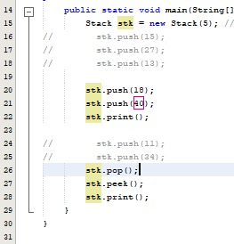
   Output
   * 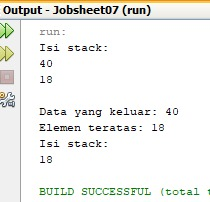
3. Angka 40 tidak masuk ke dalam Stack karena pada kode program angka 40 merupakan data top, dimana data top akan dikelurkan ketika memanggil fungsi pop(). Dan letak fungsi pop() ada di sebelum fungsi print yang digunakan untuk menampilkan isi stack, maka dari itu ketika menampilkan isi Stack kembali, angka 40 tidak masuk ke dalam isi Stack

Pertanyaan 7.3.3

1.	Data yang tersimpan pada parameter bk adalah judul, nama, tahun, jml, hrg
2.	Buku st = new Buku(8);
3.	Sesuai dengan fungsinya, perulangan do while akan menjalankan statement minimal satu kali. Pada kode program tersebut (pada class StackMain), progam akan menjalankan statement print judul, nama pengarang, tahun terbit, jumlah halaman, harga dan statement untuk menambahkan data baru ke stack (y/n)? Kemudian akan memilih y/n

Pertanyaan 7.4.3

1.	Alur kerja method derajat adalah akan memilih karakter dari variabel c, apabila karakter ‘^’ maka akan me-retrun nilai 3, apabila karakter ‘%’ maka akan me-return nilai 2, dan seterusnya sampai dengan jika karakter tidak ada pada case maka akan menjalankan default yaitu me-return 0
2.	Fungsi kode program c = Q.charAt(i); adalah untuk menampilakan inputan karakter c
3. Output
   * 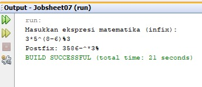

## Latihan Praktikum

1. Kode program
   * 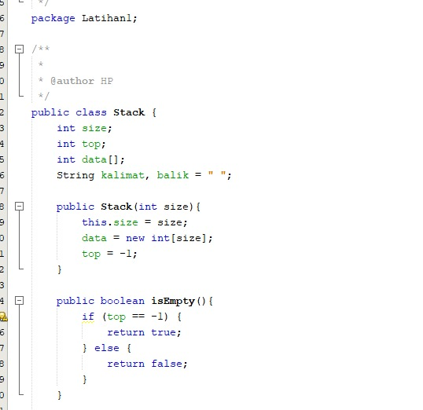
   * 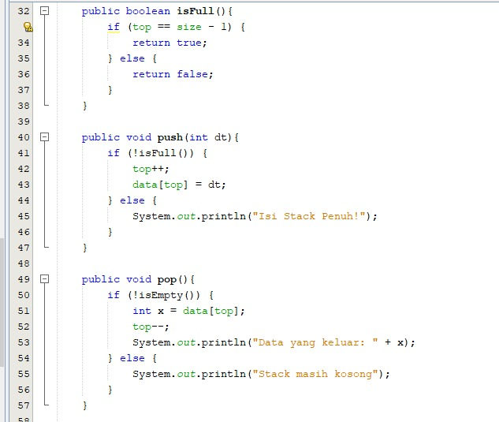
   * 
   * 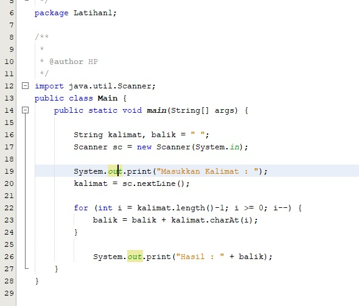
   Output
   * 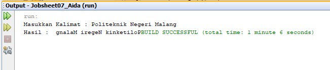

2. Kode Program
   * 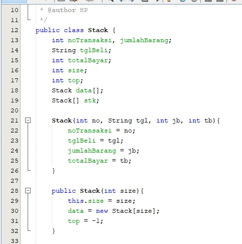
   * 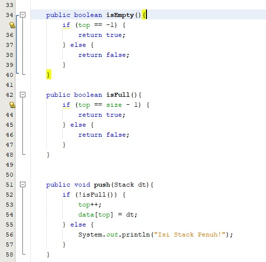
   * 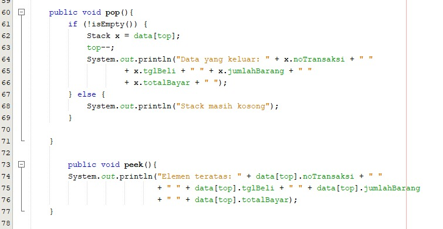
   * 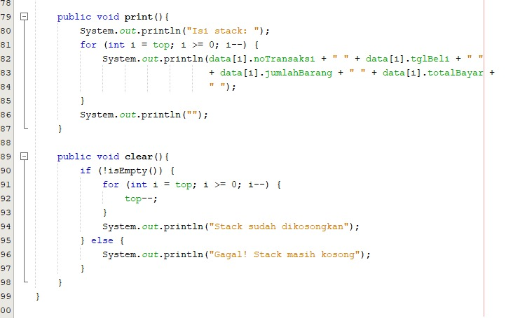
   * 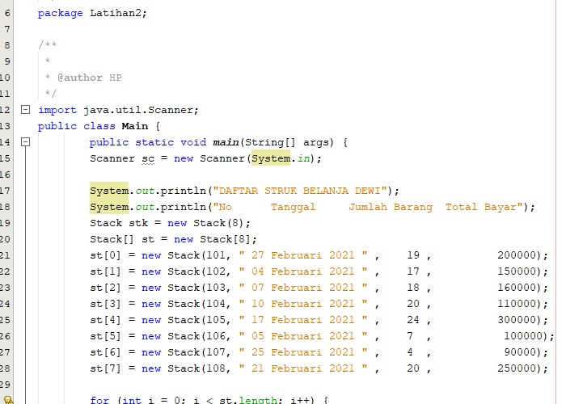
   * 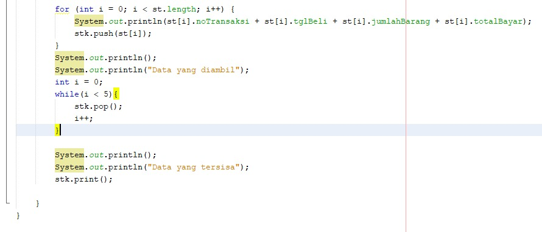
   Output
   * 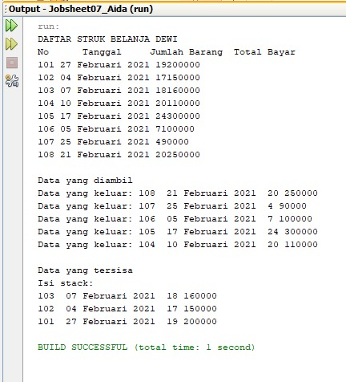